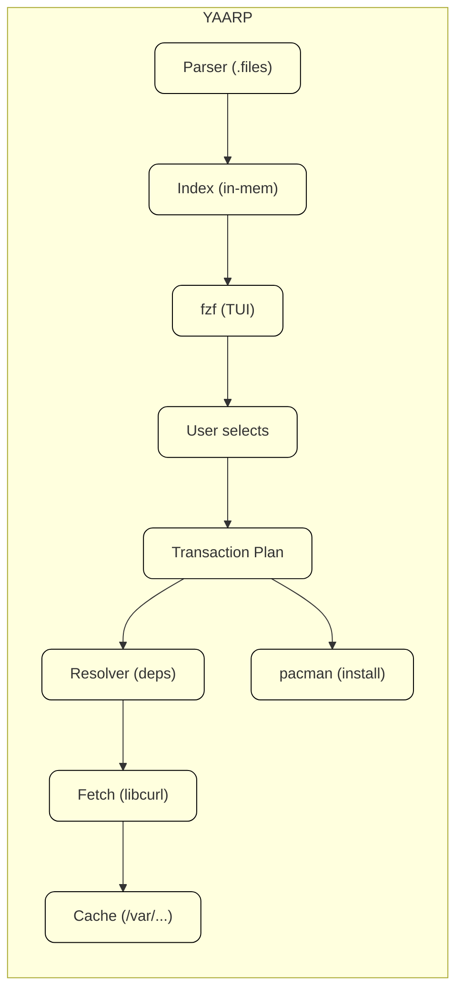

# **Yet Another Arch Pacman**
## Why?
``pacman`` is great but 5.0 MB of C, linked aainst libarchive, libcurl, gpgme, openssl... sometimes you just want to search, install and remove packages without waiting for slow startup times or fighting with flags you always forget.

yaarp gives you:
*   interactive fuzzy search via ``fzf`` built-in.
*   Startup time: a bit faster.
*   bin size: lowkey stripped
*   Mem footprint: as small as possible
*   Zero runtime deps except ``fzf`` (optional) and sys libs

## features:
| Feature | `yaarp` | `pacman` |
|---------|--------|----------|
| Fuzzy search (`fzf`) | ✅ built-in | ❌ needs wrapper |
| Binary size (stripped) | as small as possible | ~2 MB |
| Cold start | as fast as possible | ~80 ms |
| Dependencies | musl/glibc only | libarchive, libcurl, gpgme, crypto... |
| Language | C99 | C (but complex) |
| Parallel download | ✔ | ✔ |
| AUR support | via helper config | n/a |

## Requirements:
* C compiler: `gcc` or `clang` (C99 support)
* Make: any POSIX make
* Linux: Made for arch, test on arch, should work anywhere with pacman db format tho
* Optional: `fzf` for interactive mode (highly recommended)

## Usage
### interactive Mode (default):
just run it. `fzf` launches automatically
```bash
# search and install packages
yaarp

# Remove packages
yaarp -r

# only search, dont install
yaarp -s
```
### CLI Mode (script-friendly)

```bash
# install
yaarp -S neovim git ripgrep

# Remove (with depends check)
yaarp -Q

# query files owned by package
yaarp -Ql neovim

# search (regex)
yaarp -Ss '^python'

# update database
yaarp -Sy

# Full upgrade
yaarp -Su

# Show info
yaarp -Qi linux
```
### The Killer Feature: Smart FZF

```bash
# Fuzzy search remote packages -> preview info -> tab to multi-select -> enter to install
yaarp

# same but local/installed only
yaarp --local

# Combine with custom preview
yaarp --preview 'yaarp -Qi {1}'
```

#### Preview window shows:
* Package description
* Version + size
* Install date (if installed)
* Dependencies count
* Repository source

##### How it works:

###### Key design decisions:
1. Read-only by default: never modifies system without explicit ``-S``/``-R``
2. Delegates to pacman for actual install: program parses DBs itself for speed, but makes a call to ``pacman --noconfirm`` for the actual transaction (safe, audited, root-permissioned)
3. Custom DB parser: reads ``/var/lib/pacman/local/`` and sync DBs directly. No libarchive needed for read.
4. mmap where possible: package dbs are memory-based for instant search indexing

## Configuration:
``~/.config/yaarp/config.toml`` (or ``/etc/yaarp.conf``):
```conf
# Default behavior
[fzf]
preview_window = "right:40"
preview_command = "yaarp -qi {pkg}"
multi_select = true
height = "80%"

[colors]
prompt = "green"
selected = "bold+blue"

[behavior]
sort_by = "popularity"
show_orphans = true
auto_sync_db = false

[mirror]
# optional: direct download bypassing pacman (experimental)
direct_download = false
parallel_connections = 4
```

## Benchmarks

*(soon)*

## Build from source
### Quick (Release):
```bash
make release && sudo make install
```
### Custom Build
```bash
CC=clang \
CFLAGS="-O2 -march=native -flto" \
LDFLAGS="-fuse-ld=lld -flto" \
make clean release
```
### Debug Build (with sanitizers)

```bash
make debug
# Runs with ASan + UBSan, debug symbols, no opt
```
### Cross-compilation example

```bash
make CC=aarch64-linux-gnu-gcc HOST_ARCH=aarch64
```

## Answers to Questions.
> **at the time of writing this. they are still numbers, NOT PRECISE MESURES**
**Q:** is this a pacman replacement?
*A:* not fully yet, it passes installs/removals to pacman under the hood. like a frontend/shell that's faster for 90% daily use (search, query, browse)

**Q:** Why not just use ``fzf --preview 'pacman ...``?
*A:* Dude, i need to thank god i found the energy to install arch, and you want me to do that? nahh, ``yaarp`` pre-indexes the database, use mmap, has dependency-aware previews, handles AUR helpers, handles AUR helpers, and starts up a bit faster than spawning pacman per keystroke.

**Q:** Does it handle hooks?
*A:* for install operations, it calls real pacman which runs hooks normally. for it's own queries, it doesn't need them.

**Q:** Security?
*A:* Read operations are sandboxable (can run as user). Write operations (``-S``, ``-R``) require root and simply exec pacman with appropriate args. No sudo escalation tricks.

**Q:** Will it work on non-Arch distros?
*A:* No. well, i really don't know. right now it specifically targets Arch's DB format specifically. but idk, might extend it to BSD (pkg), Alpine (apk), Deb (dpkg), or RPM ig.

## Contributing:
PRs are welcome. Areas that need love:
* [] AUR helper integration (direct, not via wrapper)
* [] `pacman.conf` full parser (currently uses subset)
* [] Parallel sync DB downloads (currently sequential)
* [] Completion scripts (bash/zsh/fish)
* [] Test suite expansion (currently 60% coverage)

Style guide:
* I'll be using c99 (prob strict)
* 4 tabs.
* ``snake_case`` functions, ``UPPER_SNAKE`` macros
* Comment why, not what
* Every function: one job, clear exit paths.
* No globals (pass context struct)
* Apply KISS aggressively

# **LICENSE**
GPL © 2026. See [License](LICENSE)

---

made with frustration at slow startups and admiration for simple tools.

```text
yaarp: my sys slow y'all
```